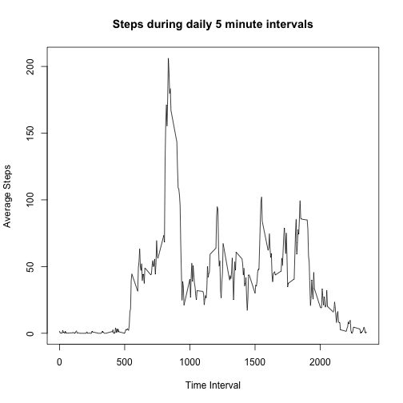
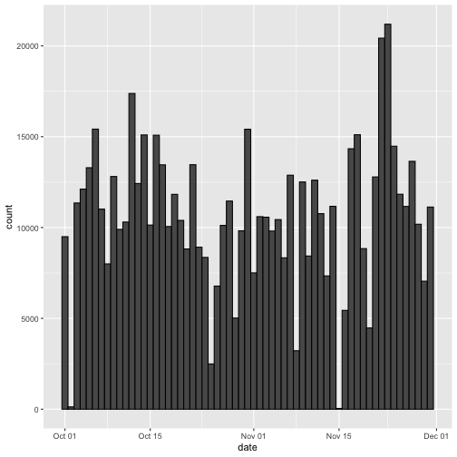

---
---
title: "Reproducible Research: Peer Assessment 1"
author: "jrblankenship"
date: "2/5/2021"
output: html_document
---

## Loading packages  
Several packages beyond the base packages will be required to run this analysis. Make sure Lubridate, dplyr, ggplot2, and mice are downloaded before running the code. This code will load in the programs (I have hidden the progress messages).

```r
library(lubridate)
library(dplyr)
library(ggplot2)
library(mice)
```

## Loading and preprocessing the data  
The following code will import the CSV data into the "activity" dataframe and transform the dates in the file into time variables using the lubridate package. The file was originally downloaded from the course website (2-5-2021 at 3:00 PM Central Time) and stored in a file on my computer. The lubridate processing will not alter the actual dates, but will make them plottable as dates in R.

```r
activity <- read.csv("~/Desktop/Coursera/data/activity.csv")
activity$date <- ymd(activity$date)
```

## What is the mean total number of steps taken per day?   
Our first question is to calculate the total number of steps taken per day. Here, we plot this as a histogram. It is important to note that we are missing a number of values throughout the dataset.

```r
total <- activity %>%
          group_by(date) %>%
          summarise(total_steps = sum(steps)) #This groups the steps by day and calculates the total steps for each day
ggplot(total) + geom_histogram(aes(x = date, weight = total_steps), color = "black", bins = 61)
```


```r
#this makes a histogram of the number of steps by study date.
```

Second, we are interested in the average and median number of steps taken per day. The code used to calculate this is below and i have used backticks to push R into inserting the values below.

```r
totalmean <- mean(total$total_steps, na.rm = TRUE); totalmed <- median(total$total_steps, na.rm = TRUE)
```
The median number of steps per day is 1.0766189 &times; 10<sup>4</sup> and the median number of steps per day is 10765.


## What is the average daily activity pattern?  
For this question, we first focus on plotting the average steps during each 5 minute interval recorded during the day. 

```r
daily <- activity %>%
            group_by(interval) %>%
            summarise(average_steps = mean(steps, na.rm = TRUE)) #Very similar to the code above, but now grouped by interval and looking at the mean instead of the total
plot(x= daily$interval, y = daily$average_steps, type = "l", xlab = "Time Interval", ylab = "Average Steps", main = "Steps during daily 5 minute intervals")
```




```r
maxinterval <- daily$interval[which.max(daily$average_steps)]
```
What time interval averages the most steps? From the plot, we could give an eyeball estimate, or we could get all mathy about it and identify the definite time interval with the most average steps per day. The code is above and I have used backticks to fill in the value below. The five minute interval with the most average daily activity is 835.

## Imputing missing values  

```r
missing <-sum(is.na(activity$steps))
```
We know there are missing values in our dataset (if you head(df) the original file, the "steps" are all 'NA'). The code above shows us that there are 2304 missing values in the original dataset.

### Where are the NA's?  
While this wasn't asked, I was interested in figuring out where the NA values were, in regards to the intervals of the day.

```r
intmiss <- activity$interval[is.na(activity$steps)]
table(intmiss)
```

```
## intmiss
##    0    5   10   15   20   25   30   35   40   45   50   55  100  105  110  115  120  125  130 
##    8    8    8    8    8    8    8    8    8    8    8    8    8    8    8    8    8    8    8 
##  135  140  145  150  155  200  205  210  215  220  225  230  235  240  245  250  255  300  305 
##    8    8    8    8    8    8    8    8    8    8    8    8    8    8    8    8    8    8    8 
##  310  315  320  325  330  335  340  345  350  355  400  405  410  415  420  425  430  435  440 
##    8    8    8    8    8    8    8    8    8    8    8    8    8    8    8    8    8    8    8 
##  445  450  455  500  505  510  515  520  525  530  535  540  545  550  555  600  605  610  615 
##    8    8    8    8    8    8    8    8    8    8    8    8    8    8    8    8    8    8    8 
##  620  625  630  635  640  645  650  655  700  705  710  715  720  725  730  735  740  745  750 
##    8    8    8    8    8    8    8    8    8    8    8    8    8    8    8    8    8    8    8 
##  755  800  805  810  815  820  825  830  835  840  845  850  855  900  905  910  915  920  925 
##    8    8    8    8    8    8    8    8    8    8    8    8    8    8    8    8    8    8    8 
##  930  935  940  945  950  955 1000 1005 1010 1015 1020 1025 1030 1035 1040 1045 1050 1055 1100 
##    8    8    8    8    8    8    8    8    8    8    8    8    8    8    8    8    8    8    8 
## 1105 1110 1115 1120 1125 1130 1135 1140 1145 1150 1155 1200 1205 1210 1215 1220 1225 1230 1235 
##    8    8    8    8    8    8    8    8    8    8    8    8    8    8    8    8    8    8    8 
## 1240 1245 1250 1255 1300 1305 1310 1315 1320 1325 1330 1335 1340 1345 1350 1355 1400 1405 1410 
##    8    8    8    8    8    8    8    8    8    8    8    8    8    8    8    8    8    8    8 
## 1415 1420 1425 1430 1435 1440 1445 1450 1455 1500 1505 1510 1515 1520 1525 1530 1535 1540 1545 
##    8    8    8    8    8    8    8    8    8    8    8    8    8    8    8    8    8    8    8 
## 1550 1555 1600 1605 1610 1615 1620 1625 1630 1635 1640 1645 1650 1655 1700 1705 1710 1715 1720 
##    8    8    8    8    8    8    8    8    8    8    8    8    8    8    8    8    8    8    8 
## 1725 1730 1735 1740 1745 1750 1755 1800 1805 1810 1815 1820 1825 1830 1835 1840 1845 1850 1855 
##    8    8    8    8    8    8    8    8    8    8    8    8    8    8    8    8    8    8    8 
## 1900 1905 1910 1915 1920 1925 1930 1935 1940 1945 1950 1955 2000 2005 2010 2015 2020 2025 2030 
##    8    8    8    8    8    8    8    8    8    8    8    8    8    8    8    8    8    8    8 
## 2035 2040 2045 2050 2055 2100 2105 2110 2115 2120 2125 2130 2135 2140 2145 2150 2155 2200 2205 
##    8    8    8    8    8    8    8    8    8    8    8    8    8    8    8    8    8    8    8 
## 2210 2215 2220 2225 2230 2235 2240 2245 2250 2255 2300 2305 2310 2315 2320 2325 2330 2335 2340 
##    8    8    8    8    8    8    8    8    8    8    8    8    8    8    8    8    8    8    8 
## 2345 2350 2355 
##    8    8    8
```
The purpose of this exercise was determine if missing values clustered at a certain time period. If they were, averaging by day might skew answers inappropriately. The table showed that the missing values were equally distributed over all time intervals (8 each), which suggests that a variety of strategies of imputing would be fine for filling in the missing data. I perhaps should have looked at whether there was skew to the days the data was missing, but the weekday/weekend pattern was not apparent until the end of the exercise.

### Filling in the missing values  
The following code uses the mice package to impute the missing data. It's using the default missing data method, pmm, or 'predictive mean matching'. It appears to be commonly used for imputing missing values, but is not perfect. 

```r
totalimp <- activity 
totalimp$steps <- as.numeric(totalimp$steps) #makes the step variable a numeric variable
totalimp <- mice(totalimp, m = 5, maxit = 50, method = "pmm", seed = 500) #imputes data using predictive mean matching to fill in the missing data (m=5 gives 5 possibilities)
comtotalimp <- complete(totalimp, 5) #resets the dataframe using the second impute possibility (any would do)
head(comtotalimp)
```

### Total steps per day  
We will now look at the imputed "complete" data, making a histogram, which can be compared to original histogram above.  

```r
imputed <- comtotalimp %>%
          group_by(date) %>%
          summarise(total_steps = sum(steps))
ggplot(imputed) + geom_histogram(aes(x = date, weight = total_steps), color = "black", bins = 61)
```


Fewer days are missing, but we do still see days with very few steps. Perhaps a different imputation method would have been more effective.  

We are interested in how the mean and median are impacted by the imputed data. The code is shown below, and I have pushed R fill in the values below.

```r
meanimputed <- mean(imputed$total_steps, na.rm = TRUE); medimputed <- median(imputed$total_steps, na.rm = TRUE)
```
The median number of steps per day is 1.0633754 &times; 10<sup>4</sup> and the median number of steps per day is 1.06 &times; 10<sup>4</sup>. These values are both lower than the non-imputed values (mean - 1.0766189 &times; 10<sup>4</sup>, median - 10765). Given the even spread of missing values, this suggests that the imputation strategy may not have been the most ideal. Based on the weekday/weekend trends, if missing data was skewed towards either weekend or weekday timepoints, this would likely impact our ability to impute data correctly.

# Are there differences in activity patterns between weekdays and weekends?  
We first need to add a column to our dataframe that marks whether days are weekdays or weekends.

```r
wkdy <- c("Monday", "Tuesday", "Wednesday", "Thursday", "Friday") #a vector of weekdays
comtotalimp$day <- factor((weekdays(comtotalimp$date) %in% wkdy), levels = c(TRUE, FALSE), labels = c("weekday", "weekend")) #matches the label to the weekday/weekend based on a logical assessment comparing to the wkdy vector
head(comtotalimp)
```

```
##   steps       date interval     day
## 1     0 2012-10-01        0 weekday
## 2     0 2012-10-01        5 weekday
## 3     0 2012-10-01       10 weekday
## 4     0 2012-10-01       15 weekday
## 5     0 2012-10-01       20 weekday
## 6     0 2012-10-01       25 weekday
```

And now we want to look at how activity varies between weekend and weekday days. We can see clear variations in the patterns. On weekdays, there is an early peak of activity, but for the most part, steps vary between 25-75 for a large part of the day. Activity started later on weekends, but was overall higher for the rest of the day, with steps varying between 25 and 150 for that time period.

```r
wkdystep <- comtotalimp %>%
        group_by(interval, day) %>%
        summarise(average_steps = mean(steps, na.rm = TRUE))
ggplot(data = wkdystep, aes(interval, average_steps)) + geom_line(color = "black", size = 1) +geom_point(color = "black") + labs(title = "Average steps", y = "Steps", x = "Time interval") + facet_wrap(~day)
```


